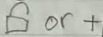
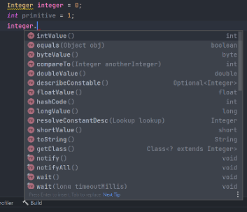
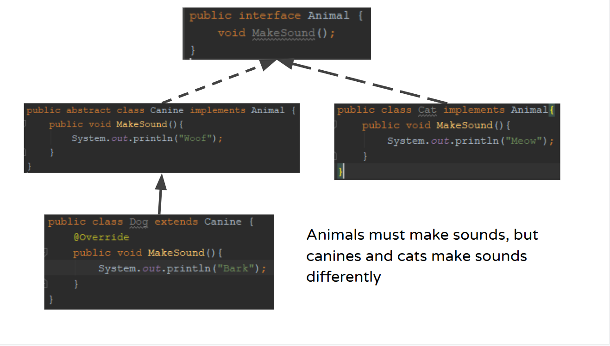
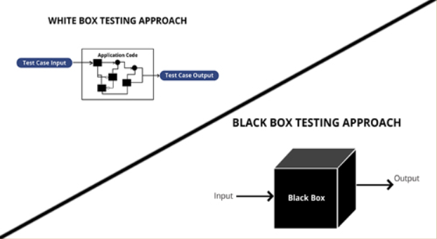
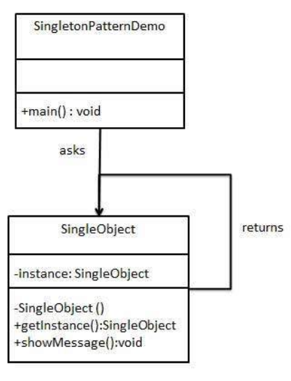
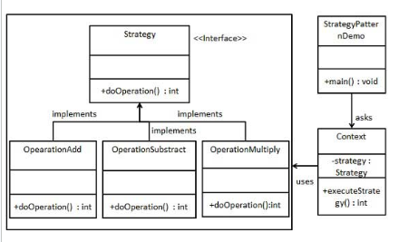

# Midterm 1 Snippets

## Table of Contents

- [Fundamentals of Java](#fundamentals-of-java)
  1. [Git and GitHub](#git-and-github)
  2. [Constructors](#constructors)
  3. [Access Modifiers and UML](#access-modifiers-and-uml)
  4. [Primitives and Wrappers](#primitives-and-wrappers)
  5. [Boxing and Unboxing](#boxing-and-unboxing)
  6. [ArrayList vs HashMap](#arraylist-vs-hashmap)
  7. [Java Class Keywords](#java-class-keywords)
  8. [this, new, and super](#this-new-and-super)
  9. [Abstract vs Interface](#abstract-vs-interface)
  10. [Extend vs Implement](#extend-vs-implement)
  11. [Override vs Overload](#override-vs-overload)
  12. [Testing: White Box vs Black Box](#black-box-vs-white-box)
- [Comparing Objects](#comparing-objects)
- [Four Pillars of OOP](#four-pillars-of-oop)
  1. [Abstraction](#abstraction)
  2. [Inheritance](#inheritance)
  3. [Encapsulation](#encapsulation)
  4. [Polymorphism](#polymorphism)
- [Design Patterns](#design-patterns)
  1. [Singleton](#singleton)
  2. [Command](#command)
  3. [Strategy](#strategy)

## Fundamentals of Java

If statements:

```Java
int a = 5;
int b = 10;
if (a > b) {
  System.out.println(a + " is greater than " + b);
}

String str1 = "apple";
String str2 = "banana";
if (str1.equals(str2)) {
  System.out.println(str1 + " is equal to " + str2);
}
```

For loop and for each loop:

```Java
int[] testArr = {1, 2, 3, 4, 5};
for (int i = 0; i < testArr.length; i++) {
  System.out.print(testArr[i] + " "); // prints 1 2 3 4 5
}

// for each
for (int number : testArr) {
  System.out.print(number + " "); // prints each number in testArr
}

// for each with strings and chars
String line = "string";

for (Character c : line.toCharArray()) {
  System.out.println(c); // prints each char of line
}
```

While loop and Modulus operator (%):

```Java
int[] arr = {1, 2, 3, 4, 5};
int i = 0;

while(i < arr.length) {
  System.out.print(arr[i] + " "); // prints 1 2 3 4 5
  i++; // must manually increment
}

// mod
int x = 10;
if (x % 2 == 0) {
  System.out.println(x + " is even!"); // returns/prints remainder of division
  // x%2 == 0 because 10 is evenly divisible by 2 = no remainder
}

// can also do
x = 9;
if (x % 2 == 1) {
  System.out.println(x + " is odd!");
  // 9 / 2 will result in a remainder of 1 so we know that 9
  // is odd because it can't be evenly divided by 2
}
```

Switch Case:

- `switch()` expression evaluated once
- the value of the expression is compared to each of the cases
- if a match is found that case block will be executed
- when a break keyword is reached, java will break out of the case block

```Java
int userInput = 5;

switch (userInput) {
  case 1:
    System.out.printf("You picked: %d%n", userInput);
    break;
  case 2:
    System.out.printf("You picked: %d%n", userInput);
    break;
  case 3:
    System.out.printf("You picked: %d%n", userInput);
    break;
  case 4:
    System.out.printf("You picked: %d%n", userInput);
    // if we forget the break, the case block will execute and then
    // go execute the next case block
  case 5:
    System.out.printf("You picked: %d%n", userInput);
    break;
  default:
    // runs only if no case matches
    System.out.println("I'm lonely down here");
}

// outputs: You picked: 5
```

Try Catch:

_“They’re like backwards if statements” ~ Dr. C_

- Use when we're not certain something will run the same 100% of the time
- Ex:
  - When reading user input using `Scanner`
  - When reading from or writing to files
- When a problem occurs an error is thrown
- Java will be looking for that error and when found, it will execute
  the catch block
- Java can look for many types of errors ex: `IOException` and `Exception`
  (most common)
- Finally will **_always_** run regardless of what happens in the try catch
  - Good for closing things like scanners or files

Syntax:

```Java
// 2 ways to do:
// 1:
Scanner scan;
try {
  String line = "";
  scan = new Scanner(System.in); // place problematic code within try catch

  line = scan.nextLine();
  System.out.println(line);
} catch (Exception e) {
  System.out.println("Oh no! We ran into an error!");
  System.out.println("Error: " + e);
} finally {
  System.out.println("I always execute.");
  System.out.println("This means that I can close pesky files or console inputs.");
  scan.close(); // make sure not to close me too early!
                // that can lead to later problems!
}
```

```Java
// 2:
FileWriter file = new FileWriter(filename);
try (Scanner scan = new Scanner(file)) {
  // this version will automatically close the scanner when we're done with it
  String line = "";

  while(scan.hasNextLine()) {
    line = scan.nextLine();
    System.out.println("Current line: " + line);
  }
} catch (IOException | Exception e) { // we can also look for multiple Exception
                                      // with the '|' operator
  System.out.println("This is an error: " + e);
}
```

## Git and GitHub

Git:

- An extremely useful version control system
- Allows you to save the state of your files in a particular moment
  - Save the version in something called a _repository_
    - Save a state through something called a _commit_
  - This gives you the power to go back to a previous version if you make a mistake
  - It also allows you to go back to a previous version to test something
  - You can also make a new copy in the form of a branch to change something
    without altering what already works

GitHub:

- An online database of Git repositories

All Git and GitHub commands and what they do:

| Command                                 | What it does:                                                                                     |
| --------------------------------------- | ------------------------------------------------------------------------------------------------- |
| git status                              | shows current state of branch                                                                     |
| git add .                               | stages all changes for a commit                                                                   |
| git add /filepath/                      | stages one specific path for a commit                                                             |
| git commit -m ""                        | commits currently staged files with a given message                                               |
| git commit                              | opens up a VIM style terminal to write longer and more complex messages                           |
| git stash                               | must use after `git add`, takes all currently staged files and hides them from a commit or switch |
| git stash /filepath/                    | stashes a specific filepath                                                                       |
| git stash pop                           | unstash the last thing that was stashed                                                           |
| git log                                 | list all commits                                                                                  |
| git show                                | display last commit                                                                               |
| git show <commit_hash>                  | each commit has a hash to identify it, you can use this command to see it                         |
| git checkout <branch_name>              | moves you to a new branch                                                                         |
| git switch <branch_name>                | does the same thing as git checkout <branch_name>                                                 |
| git checkout -b <new_branch_name>       | creates new branch                                                                                |
| git remote -v                           | displays all remote repositories currently connected                                              |
| git remote add origin <github_link.git> | add new remote repository under the name origin                                                   |
| git remote remove <name>                | remove remote repository link at that name                                                        |
| git merge <branch_name>                 | merges <branch_name> into checked out branch                                                      |
| git rebase <branch_name>                | takes commits from <branch_name> and places them on top of all commits of checked out branch      |

## Constructors

Used to initialize objects also used to set values.

**Default:** When no constructor is created, a default constructor is called when instantiating an object
**Parameterized:** If a constructor is created it will override the default and is custom to the programmer

```Java
Card card = new Card();
Card card = new Card("Diamonds", 5);
```

Constructor Example:

```Java
// parameterized:
public Monster() {
  this.type = "ghoul";
  this.strength = 100;
  this.health = 1000;
}

// parameterized with parameters
public Monster(string type, int strength, int health) {
  this.type = type;
  this.strength = strength;
  this.health = health;
}
```

## Access Modifiers and UML

|           | Class | Package | Subclass | Global |
| --------- | ----- | ------- | -------- | ------ |
| Public    | Yes   | Yes     | Yes      | Yes    |
| Protected | Yes   | Yes     | Yes      | No     |
| Default   | Yes   | Yes     | No       | No     |
| Private   | Yes   | No      | No       | No     |

_Remember!_ Package-private and default mean the same thing since variables and methods are set as package-private if not access modifier is specified!

### UML

_Remember!_ UML Access Modifier symbols in UML are based on location!

- Abstract (Pool ball symbol): 

- Final (top left symbol): 

- Static (bottom left and/or underlined): 

- Public (open lock or +): 

- Private (closed lock or -): 

- Protected (key or #): 

- Default/Package Private (circle or ~): 

- Extends (solid arrow): 

- Implements (dashed arrow): 

- Direction arrow points: Can provide all the methods of the class the arrow is pointing at.

## Primitives and Wrappers

**Primitive Types:** int, double, char...

- Simple types

**Wrapper Classes:** Integer, Double, Character...

- Objects containing methods to use such as .equals()



## Boxing and Unboxing

**Boxing:** Converting a primitive type &rarr; wrapper class

```Java
int primitive = 50;
Integer wrapper = primitive;
```

**Unboxing:** Converting a wrapper class &rarr; primitive type

```Java
Integer wrapper = 50;
int primitive = wrapper;
```

## ArrayList vs HashMap

### ArrayList

ArrayList &rarr; A list of single data types
Declaration:
`ArrayList<Reference_Type> name = new ArrayList<>();`

```Java
ArrayList<String> arr = new ArrayList<>();

arr.add("Hello");
arr.add("My");
arr.add("Name");
arr.add("Is");
arr.add("Bob");

int arrayListSize = arr.size(); // returns size of list
System.out.println("Size: " + arrayListSize);

// get specific element at specified index (0 in this case)
String ele = arr.get(0);
System.out.println(ele); // prints "Hi"

arr.remove(2); // removes "Name"
// list is now: {Hello, My, "Is", "Bob"}

arr.set(2, "Hola");
// list is now: {Hello, My, Hola, Bob}

// if you want to run this code make sure you use: import java.util.ArrayList;
for (String s : arr) {
  System.out.printf("%s%t", s);
}
```

### HashMap

HashMap = A list of key and value pairs

```Java
HashMap<Integer, String> hm = new HashMap<>();

hm.put(0, "Hi");
hm.put(1, "My");
hm.put(3, "Is");
hm.put(2, "Name");
hm.put(4, "Bob");

int mapSize = hm.size(); // returns size of map
String ele = hm.get(1); // finds the key provided and returns the value associated with it
System.out.println(mapSize + " " + ele);
hm.remove(3);
// current hm:
/*
  * Hi
  * My
  * Name
  * Bob
  */
hm.replace(2, "Charlie");
/*
  * Hm is now:
  * Hi
  * My
  * Charlie
  * Bob
  */

System.out.println("Hm key 2 value: " + hm.get(2));
hm.put(0, "Hola"); // also replaces value at key 0 with "Hola"

// make sure if you run this code to use import java.util.HashMap;

// prints only keys
System.out.println("Keys:");
for (Integer key : hm.keySet()) {
  System.out.println(key);
}

// prints only values
System.out.println("Values:");
for (String value : hm.values()) {
  System.out.println(value);
}
```

## Java Class Keywords

### Instance vs Static vs Final

**Instance:** `Card c = new Card();`

- When you use the keyword "**new**", you create an instance of the object
- They can be marked as final
- They can't be marked abstract
- They can't be marked static

**Static:** `public static void m();`

- Can be applied to: methods and fields
- Static members can be accessed without creating an instance of the object

**Static Variables:** `public static int num;`

- Variable is shared by all instances of a class

**Final:** `public final void m();`

- Can be applied to: classes, methods, and fields
- Makes things constant and prevents overriding

**Final Variables:** `public final SIZE = 5;`

- Variables can only ever be assigned once and the value can never be changed
  - Variables marked with ALL_CAPS are typically final variables

## this new and super

**_this_** &rarr; accesses the current object
`this.hp -= 10;`

**_`this("parent", "child");`_** calls its own constructor within the given parameter

Example:

```Java
public class Parent {
  private String parentString;

  Parent(String s) {
    this.parentString = s;
  }
}


class Child extends Parent {
  private String childString;

  Child() {
    this("parent", "child"); // calls own constructor with passed values
  }

  Child(String s1, String s2) {
    super(s1); // calls parent constructor with passed value
    this.childString = s2;
  }
}
```

**_new_** &rarr; creates a new instance of an object
`Object obj = new Object(param);`

**_super_** &rarr; accesses the parent object (the class that the current class is extending)

```Java
ChildObject { // constructor
  super();
  hp = 100;
}
```

**_`super(s1);`_** &rarr; calls the constructor in its parent class

Example:

```Java
public class Parent {
  private String parentString;

  Parent(String s) {
    this.parentString = s;
  }
}

class Child extends Parent {
  private String childString;

  Child() {
    this("parent", "child"); // calls own constructor with passed values
  }

  Child(String s1, String s2) {
    super(s1); // calls parent constructor with passed value
    this.childString = s2;
  }
}
```

## Abstract vs Interface

**Abstract Classes:**

- Instances can't be created
- Can have abstract and concrete methods
- Cannot be declared final (think about it)
- Other classes can only extend at most **ONE** abstract class

**Interface:**

- Blueprint/behavior of the class
  - Specifies what a class must do and _not_ how
- Used to achieve loose coupling
- Other classes can implement **MANY** interfaces



Reading the above definitions which of the snippets is correct?

```Java
A) Cat cat = new Animal();
B) Animal animal = new Dog();
C) Canine dog = new Canine();
```

**Answer (click to reveal):**

  <details>
    <summary>Answer</summary>

    B) `Animal animal = new Dog();`

  </details>

### Extend vs Implement

**Extending:**

- When a class is inheriting from another class (abstract or not)
- When an interface is inheriting from another interface

`public interface Card extends Deck {}`

**Implementing:**

- When a class is inheriting from an interface

`public abstract class Monster implements Attack {}`

## Override vs Overload

**Override:**

- Rewriting the code passed down from a parent class

Ex:

```Java
@Override
public String toString() {
  return "Hello World!";
}
```

**Overloading:**

- Making multiple variants of a method with the same name but different parameters

Ex:

```Java
int myMethod(int x) {
  return x;
}

float myMethod(float x) {
  return x;
}

double myMethod(double x, double y) {
  return x + y;
}
```

## Black Box vs White Box

**White Box Testing:**

- When the tester has access to the code being tested
  - Path Testing
  - Loop Testing
  - Condition Testing

**Black Box Testing:**

- When the tester doesn't have access to the code
  - Functional Testing
  - Non-functional Testing
  - Regression Testing



## Comparing Objects

### Checking Object Type

"**instanceof**" &rarr; a keyword for checking if a reference variable is containing a given type of object reference or not

- returns a boolean (true/false)

```Java
for (Animal a : animals) {
  if (a instanceof Dog) {
    System.out.println("True!");
  }
}
```

## Four Pillars of OOP

Don't forget PIE-A!

### Abstraction

Using abstract methods and classes to provide the ability to reuse and modify code as needed.

```Java
// Abstract class
abstract class Animal {
  // abstract method (no body)
  public abstract void animalSound();
  // concrete method
  public void sleep() {
    System.out.println("Zzz");
  }
}
```

```Java
// Subclass (inherits from Animal)
class Pig extends Animal {
  public void animalSound() {
    System.out.println("The pig says: 'Sup boss");
  }
}
```

```Java
class Main {
  public static void main(String[] args) {
    Animal animal = new Animal(); // will create error:
    // must inherit from another class to access the abstract class
    Pig pig = new Pig();
    pig.animalSound(); // prints 'Sup boss
    pig.animalSound(); // prints Zzz
  }
}
```

### Inheritance

Passing down fields and methods for other classes to use

- Extending classes and implementing interfaces

```Java
class Vehicle {
  protected String brand = "Ford";
  public void honk() {
    System.out.println("Tuut, tuut!");
  }
}
```

```Java
class Car extends Vehicle {
  private String model = "Mustang";
  public static void main(String[] args) {
    Car car = new Car();

    // honk defined inside vehicle class
    car.honk();

    // display brand and model
    System.out.println(car.brand + " " + car.model);
  }
}
```

### Encapsulation

Hiding explicit data from objects that don't need to know about that data

- Storing specific data into classes

```Java
class Person {
  private String name;

  // getter
  public String getName() {
    return name;
  }

  // setter
  public void setName(String newName) {
    this.name = newName;
  }
}
```

```Java
public class Main {
  public static void main(String[] args) {
    Person person = new Person();
    person.name = "John"; // error, can't access directly
    System.out.println(person.name); // error; still can't access directly
    person.setName("Dr. C");
    System.out.println(person.getName()); // prints "Dr. C"
  }
}
```

### Polymorphism

Storing multiple objects into a single instance

- Using a parent class as a container for the child class but not vice versa

```Java
class Animal {
  public void animalSound() {
    System.out.println("The animal sounds like schrodinger's cat");
  }
}

class Cat extends Animal {
  public void animalSound() {
    System.out.println("The cat says: ....");
  }
}

class Dog extends Animal {
  public void animalSound() {
    System.out.println("The dog says: You killed him!");
  }
}
```

```Java
class Main {
  public static void main(String[] args) {
    Animal animal = new Animal(); // create Animal object
    Animal cat = new Cat();
    Animal dog = new Dog();
    animal.animalSound(); // prints: The animal sounds like schrodinger's cat
    cat.animalSound(); // prints: The cat says: ....
    dog.animalSound(); // prints: The dog says: You killed him!
  }
}
```

### Questions

Given the code: Which of the following are correct?

```Java
class Monster{}

class Ghoul extends Monster{}

class Werewolf extends Monster{}

class Vampire extends Monster{}

class Dracula extends Vampire{}
```

```Java
A) Ghoul ghoul = new Monster();
B) Vampire vampire = new Dracula();
C) Monster monster = new Werewolf();
D) Dracula dracula = new Vampire();
```

  <details>
    <summary>Answer:</summary>
    
    B) `Vampire vampire = new Dracula();`

    C) `Monster monster = new Werewolf();`

    __Explanation:__
    A parent class can be instantiated as its child class, but a child class cannot be instantiated as a parent class.

  </details>

<br>

Given the code: Which of the following are correct?

```Java
class Animal{}

class Dog extends Animal{}

class Cat extends Animal{}

class Bird extends Animal{}

class Lion extends Cat{}
```

```Java
A) Lion lion = new Cat();
B) Bird bird = new Animal();
C) Animal animal = new Dog();
D) Cat cat = new Lion();
```

  <details>
    <summary>Answers:</summary>

    C) `Animal animal = new Dog();`

    D) `Cat cat = new Lion();`

  </details>

## Design Patterns

### Singleton

- Only one instance of an object may exist
- You must use Class.getInstance() to access the object
  - Cannot instantiate the object

```Java
public class Singleton {
  private static Singleton instance = null;
  private int singletonInt;

  Singleton() {
    singletonInt = 10;
  }

  public static Singleton getInstance() { // static methods require
                                          // the class name to call: Singleton.getInstance()
    if (instance == null) { // if a singleton doesn't exist yet instantiate one
      instance = new Singleton();
    }

    return instance;
  }

  public static void main(String[] args) {
    Singleton x = Singleton.getInstance();
    Singleton y = Singleton.getInstance();
    Singleton z = Singleton.getInstance();

    System.out.println("x : " + x.singletonInt);
    System.out.println("y : " + y.singletonInt);
    System.out.println("z : " + z.singletonInt);

    x.singletonInt = 15;

    System.out.println("x : " + x.singletonInt);
    System.out.println("y : " + y.singletonInt);
    System.out.println("z : " + z.singletonInt);
  }
}
// Prints:
/*
x : 10
y : 10
z : 10
x : 15
y : 15
z : 15
*/
```



```Java
public class SingleObject {
  // create object of SingleObject
  private static SingleObject instance = new SingleObject();

  // make constructor private so class can't be instantiated
  private SingleObject(){}

  // get only object available
  public static SingleObject getInstance() {
    return instance;
  }

  public void showMessage() {
    System.out.println("Hello world!");
  }

  public static void main(String[] args) {
    // illegal construct
    // Compile time error: constructor SingleObject() is not visible
    // SingleObject object = new SingleObject();

    // only object available
    SingleObject object = SingleObject.getInstance();

    // show message
    object.showMessage();
  }
}
```

### Command

Encapsulates a request as an object

- Allows you to parameterize clients with different requests
- Stores actions or commands
  - Copying commands into history list
    - E.g.:
    - Instant replay
    - Undo/redo commands
    - On/off commands

```Java
Queue queue;

queue.add(Cara.do(surpriseAttack));
queue.add(Mando.do(fightBack));
queue.add(BabyYoda.do(sipTea));
```

```Java
if (buttonPressed == button1) {
  lights.on();
}
```

Example Code:

```Java
interface Command {
  public void execute(); // command will always have something named similar to execute
}

class Light {
  public void on() {
    System.out.println("Light is on");
  }

  public void off() {
    System.out.println("Light is off");
  }
}

class LightOnCommand implements Command {
  Light light;

  // constructor is passed the light it will control
  public LightOnCommand(Light light) {
    this.light = light;
  }

  public void execute() {
    light.on();
  }
}

class LightOffCommand implements Command {
  Light light;
  public LightOffCommand(Light light) {
    this.light = light;
  }
  public void execute() {
    light.off();
  }
}
```

```Java
class Stereo {
  public void on() {
    System.out.println("Stereo is on");
  }

  public void off() {
    System.out.println("Stereo is off");
  }

  public void setCD() {
    System.out.println("Stereo is set for CD input");
  }

  public void setDVD() {
    System.out.println("Stereo is set for DVD input");
  }

  public void setRadio() {
    System.out.println("Stereo is set for Radio input");
  }

  public void setVolume(int volume) {
    System.out.printf("Stereo volume is set to %d volume%n", volume);
  }
}
```

```Java
class StereoOffCommand implements Command {
  Stereo stereo;
  public StereoOffCommand(Stereo stereo) {
    this.stereo = stereo;
  }

  public void execute() {
    stereo.off();
  }
}

class StereoOnWithCDCommand implements Command {
  Stereo stereo;
  public StereoOnWithCDCommand(Stereo stereo) {
    this.stereo = stereo;
  }
  public void execute() {
    stereo.on();
    stereo.setCD();
    stereo.setVolume(11);
  }
}
```

```Java
// simple remote control with one button
class SimpleRemoteControl {
  Command slot; // only one button

  public SimpleRemoteControl(){}

  public void setCommand(Command command) {
    // set the command the remote will execute
    this.slot = command;
  }

  public void buttonWasPressed() {
    slot.execute();
  }
}
```

```Java
// Driver class
class RemoteControlTest {
  public static void main(String[] args) {
    SimpleRemoteControl remote = new SimpleRemoteControl();
    Light light = new Light();
    Stereo stereo = new Stereo();

    // change command dynamically
    remote.setCommand(new LightOnCommand(light));
    remote.buttonWasPressed();
    remote.setCommand(new StereoOnWithCDCommand(stereo));
    remote.buttonWasPressed();
    remote.setCommand(new StereoOffCommand(stereo));
    remote.buttonWasPressed();
  }
}
```

### Strategy

Multiple variants of the same behavior

- Interchangable encapsulated behaviors

```Java
dog.setAction(new Howl());
dog.doSomething();

dog.setAction(new Sleep());
dog.doSomething();
```



```Java
public interface Strategy {
    public int doOperation(int num1, int num2);
}
```

```Java
// Addition Strategy
public class OperationAdd implements Strategy {
    @Override
    public int doOperation(int num1, int num2) {
        return num1 + num2;
    }
}

// Subtraction Strategy
public class OperationSubstract implements Strategy {
    @Override
    public int doOperation(int num1, int num2) {
        return num1 - num2;
    }
}

// Multiplication Strategy
public class OperationMultiply implements Strategy {
    @Override
    public int doOperation(int num1, int num2) {
        return num1 * num2;
    }
}
```

```Java
public class Context {
    private Strategy strategy;

    public Context(Strategy strategy) {
        this.strategy = strategy;
    }

    public int executeStrategy(int num1, int num2) {
        return strategy.doOperation(num1, num2);
    }
}
```

```Java
public class StrategyPatternDemo {
    public static void main(String[] args) {
        Context context = new Context(new OperationAdd());
        System.out.println("10 + 5 = " + context.executeStrategy(10, 5));

        context = new Context(new OperationSubstract());
        System.out.println("10 - 5 = " + context.executeStrategy(10, 5));

        context = new Context(new OperationMultiply());
        System.out.println("10 * 5 = " + context.executeStrategy(10, 5));
    }
}
```
